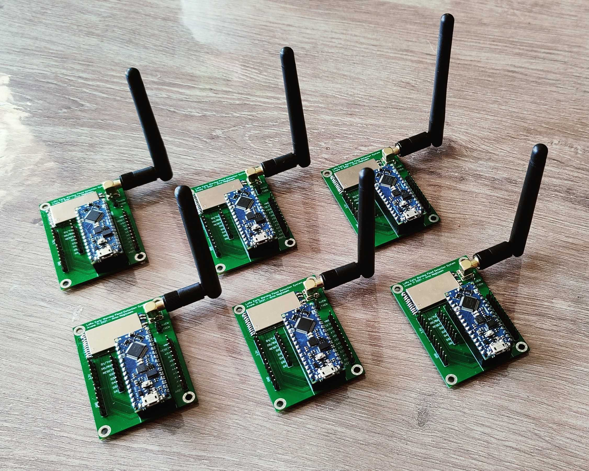

# LoraForNepal
Proof-of-concept for Lora 2.4GHz Early Warning System for Nepal
 
 

## background
---

Nepal has to deal with the Monsoon every year. This is a period of six months with a lot of rain. Due to this rainfall, it often happens that rivers flood with catastrophic consequences for communities around rivers. With recent past records of disaster during the Monsoon flood, telemetric systems for data monitoring were realized to be essential and found to be successful to help warn the communities. Everyone is well aware of the large number of casualties that the natural disasters like floods have brought in the past, especially in the far Western and Southern regions of Nepal. Even though it is not possible to challenge the force of nature, it is possible to take preventive measures to reduce these numbers. Different efforts have been forwarded in the past from various authorities. The analysis shows a timely dissemination of the river level reading could warn the people early and save thousands of lives and properties. The early warning system for flood detection is being developed for this very purpose. 
 
 
 

##### The impact of the monsoon period
 
 
Robotics Association of Nepal (RAN) has already developed a system to measure water levels and predict floods. The problem they face is that they don't have sufficient technical knowledge to transfer this data to the right community in Nepal. RAN has indicated that they want to develop a LoRa (Long Range) 2.4GHz network to send data from the river to the community. 
 
 
Diyalo Foundation is committed to the Nepalese population with a focus on helping Nepalese youth to develop technical projects. They have made contact with RAN and from this contact the LoRa early warning flood detection project was created. After conceiving this project, Diyalo Foundation went looking for experts in the field of LoRa. Contact has been made with KPN as they have set up a LoRa network in the frequency band 863 - 870 MHz in the Netherlands. Due to legislation in Nepal, the LoRa network in Nepal will have to function on the 2.4GHz frequency band. Since KPN has no experience with this, the Diyalo Foundation has searched further and eventually ended up with a teacher at Avans Hogeschool. He has accepted this project and has appointed four students of computer science to carry out this project.

This project created by the four students of Avans is a working proof of concept of the early warning flood detection system.  

 
 

## working of the project
----

The project is a network made up of LoRa modules each module is a node in the network. The network consists of three types of nodes: a repeater node, a sensor node and a Gateway. Within the network the data is sent from the sensor to the gateway so these are the end-points of the network. Getting the data from the sensor to the gateway is done by repeater nodes, these nodes receive data and when they receive the data they check if the message is a new message and then sends it to every node within its range. This way the messages do not get duplicated and always arrive at their destination. 

 

The picture above discribes in what way the sensor data gets send through the network. Every normal line is an accepted message that is sent through the network. Every dotted line is a message that the repeaters ignore because the message is already in their backlog.

 
 

The hardware that is used to make a repeater node is an Arduino Nano Every, the NiceRF LoRa1280F27-TCXO module, a circuit board and an omnidirectional 2dbi antenna. These components work together to create a working programmable LoRa module. This is what the repeater node look like:

 

Both the gateway and the sensor module do not have a completed module since the right sensor was not available in the Netherlands. De gateway module did not have a completed design because of time constrains.

 
 

# Disclaimer

There are inherent dangers in the use of any software available for download on the Internet, and we caution you to make sure that you completely understand the potential risks before downloading any of the software.

The Software and code samples available on this website are provided "as is" without warranty of any kind, either express or implied. Use at your own risk.

The use of the software and scripts downloaded on this site is done at your own discretion and risk and with agreement that you will be solely responsible for any damage to your computer system or loss of data that results from such activities. You are solely responsible for adequate protection and backup of the data and equipment used in connection with any of the software, and we will not be liable for any damages that you may suffer in connection with using, modifying or distributing any of this software. No advice or information, whether oral or written, obtained by you from us or from this website shall create any warranty for the software.

We make makes no warranty that

- the software will meet your requirements
- the software will be uninterrupted, timely, secure or error-free
- the results that may be obtained from the use of the software will be effective, accurate or reliable
- the quality of the software will meet your expectations
- any errors in the software obtained from us will be corrected. 

The software, code sample and their documentation made available on this website:

>could include technical or other mistakes, inaccuracies or typographical errors. We may make changes to the software or documentation made available on its web site at any time without prior-notice.
may be out of date, and we make no commitment to update such materials. 

We assume no responsibility for errors or omissions in the software or documentation available from its web site.

In no event shall we be liable to you or any third parties for any special, punitive, incidental, indirect or consequential damages of any kind, or any damages whatsoever, including, without limitation, those resulting from loss of use, data or profits, and on any theory of liability, arising out of or in connection with the use of this software. 